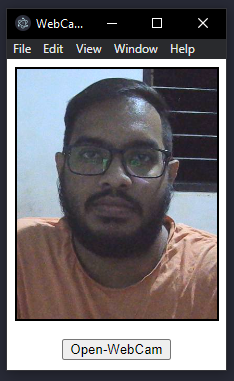

# Web Camera Application

## To Use

To clone and run this repository you'll need [Git](https://git-scm.com) and [Node.js](https://nodejs.org/en/download/) (which comes with [npm](http://npmjs.com)) installed on your computer. From your command line:

```bash
# Clone this repository
git clone https://github.com/paradocx96/Web-Cam-Application
# Go into the repository
cd Web-Cam-Application
# Install dependencies
npm install
# Run the app
npm start
```

Note: If you're using Linux Bash for Windows, [see this guide](https://www.howtogeek.com/261575/how-to-run-graphical-linux-desktop-applications-from-windows-10s-bash-shell/) or use `node` from the command prompt.

## To Package the Application

```bash
# Using Electron Forge
npm run make
```

## User Interface



## License

[MIT](LICENSE.md)
